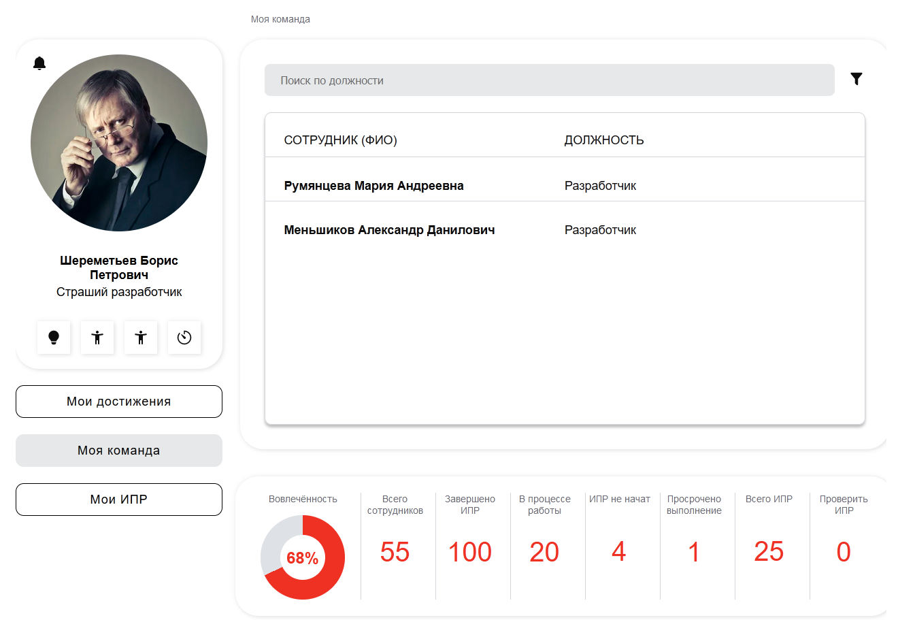

# Backend Проекта "ИПР". Хакатон Яндекс-Альфа-Банк. Команда №8

\

Проект для отслеживания индивидуальных планов развития.\
Сделан командой № 8 в рамках хакатона Яндекс-Практикума и Альфа-Банка.\
Для ознакомления, проект временно [доступен на сервере](https://ipr.ddns.net/), для входа используйте [эти аккаунты](./docs/authorization.md).

## [Ссылка на репозиторий Frontend](https://github.com/NataliyaNikulshina/ipr-hackathon-yandex-alfa)

## Запуск проекта

### 1. Требуется заполнить `.env` файл

- пример заполнения находится в `.envexample`

### 2. Запуск проекта

- Весь проект, используя docker:  `docker compose up`
  - Проект будет доступен по адресу `localhost:8080`
- Локальный запуск бэкенда:
  - Перейти в папку со скопированным проектом
  - Создание __venv__ `python -m venv venv`
  - Установка зависимостей `pip install -r requirements.txt`
  - Запуск сервера разработки `python manage.py runserver`

### 3. [Загрузка фикстур в БД](docs/authorization.md) - _Опционально_

## Документация API

- Документация на сервере: [Swagger](https://ipr.ddns.net/api/v1/schema/swagger-ui/), [ReDoc](https://ipr.ddns.net/api/v1/schema/redoc/)
- Скриншоты Swagger: [Развернутый](./docs/pics/doc_full_size.png), [Не развернутый](./docs/pics/doc.png)
- Документация на запущенном локально сервере: [Swagger](http://127.0.0.1:8000/api/v1/schema/swagger-ui/), [ReDoc](http://127.0.0.1:8000/api/v1/schema/redoc/)

## Используемые библиотеки и зависимости

| Библиотека | Описание |
|-|-|
| [Python 3.12](https://www.python.org/) | Язык программирования Python версии 3.12.|
| [Django](https://pypi.org/project/Django/)| Основной фреймворк для разработки веб-приложений. |
| [DRF](https://pypi.org/project/djangorestframework/)| Фреймворк для создания API в приложениях Django.|
| [Gunicorn](https://pypi.org/project/gunicorn/)| WSGI-сервер для запуска веб-приложений Django. |
| [Environs](https://pypi.org/project/environs/) | Библиотека для управления переменными окружения и хранения секретов. |
| [drf-spectacular](https://drf-spectacular.readthedocs.io/en/latest/index.html) | Генератор документации и Swagger для API в Django. |
| [Djoser](https://pypi.org/project/djoser/) | Библиотека для обеспечения аутентификации в приложениях Django. |
| [Pillow](https://pypi.org/project/pillow/) | Библиотека для обработки изображений в Python. |
| [Django filter](https://pypi.org/project/django-filter/) | Библиотека для фильтрации данных в приложениях Django. |
| [Django Notifications](https://github.com/django-notifications/django-notifications) | Уведомления. |
| [django-cors-headers](https://pypi.org/project/django-cors-headers/) | Что-то делает с headers |
| [django-dirtyfields](https://django-dirtyfields.readthedocs.io/en/stable/quickstart.html) | Для доступа к измененной информации в джанго сигнале `post_save` |
| [Flake8](https://pypi.org/project/flake8/), [black](https://pypi.org/project/black/), [isort](https://pypi.org/project/isort/), [Pre-commit](https://pypi.org/project/pre-commit/) | Инструменты для поддержания Code-Style в проекте. |

## Code-Style при разработке

### Локальный запуск pre-commit

- В начале требует активации хуков `pre-commit install`
- Далее будет запускаться при попытке сделать commit или при запуске `pre-commit`

## Авторы

- [Miron Sadykov](https://github.com/Reagent992)
- [Mikhail Volkov](https://github.com/greenpandorik)
- [Артур Галиаскаров](https://github.com/Arti1946)
- [Ilya Kotenko](https://github.com/IlyaKotenko)
